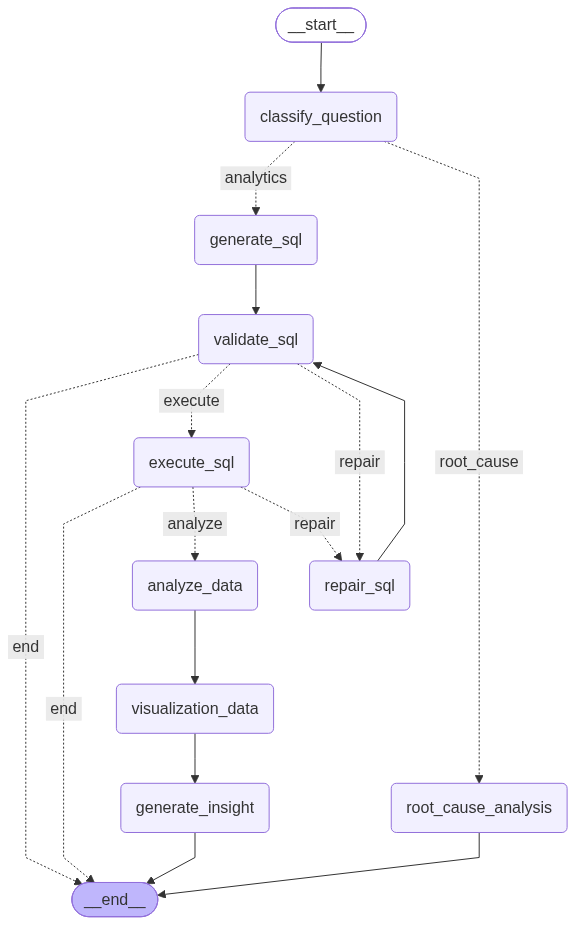

# 🤖 AI Business Analyst

> An LLM-powered business analytics agent that converts natural-language business questions into SQL, validates and executes queries, automatically repairs SQL execution errors, analyzes results, generates visualizations, and produces business-friendly insights.

---

## 📌 Overview

**AI Business Analyst** is an intelligent business analytics application built using **LangGraph, Python, PostgreSQL, Gemini, Groq, Streamlit, Pandas, and Plotly**.

The system allows business users to interact with structured business data using natural language instead of manually writing SQL queries.

For example, a user can ask:

> **"Which product category generated the most revenue?"**

The system automatically:

```text
Natural Language Question
          ↓
Intent Detection
          ↓
SQL Generation
          ↓
SQL Validation
          ↓
PostgreSQL Execution
          ↓
Execution Error?
     ↙          ↘
   Yes           No
    ↓             ↓
 SQL Repair    Data Analysis
    ↓             ↓
 Re-execute   Visualization
     ↘          ↙
      Business Insight
---

## 🎯 Problem Statement

Traditional business analysis often requires users to manually write SQL queries, validate database results, analyze data, create visualizations, and interpret the findings.

AI Business Analyst automates this workflow by allowing users to ask business questions in natural language.

For example:

> "Which product category generated the most revenue?"

The system automatically converts the question into SQL, validates and executes the query, analyzes the result, generates a visualization, and produces a business-friendly insight.
---

## 🚀 Key Features

- 🧠 Natural-language business analytics
- 🔄 LangGraph-based agent orchestration
- 🤖 Gemini → Groq LLM fallback
- 🔐 SQL validation before execution
- 🔧 Automatic SQL self-correction
- 🗄️ PostgreSQL database integration
- 📊 Automatic KPI and chart generation
- 🔍 Root-cause analysis
- 💡 AI-generated business insights
- 🖥️ Streamlit analytics interface

---

## 🏗️ Architecture



The application uses a stateful LangGraph workflow to coordinate the different stages of the business analysis process.

---

## ⚙️ How It Works

```text
User Question
      ↓
Intent Detection
      ↓
SQL Generation
      ↓
SQL Validation
      ↓
PostgreSQL Execution
      ↓
Execution Error?
   ↙          ↘
 Yes           No
  ↓             ↓
SQL Repair   Data Analysis
  ↓             ↓
Re-execute  Visualization
   ↘          ↙
    Business Insight

---

## 🔧 SQL Self-Correction

The system can automatically repair certain SQL queries that are rejected during database execution.

For example, an LLM may generate:

```sql
JOIN productss p
    ON oi.product_id = p.product_id

---

## 🤖 LLM Provider Fallback

The application uses a fallback strategy to improve reliability.

```text
Gemini
   ↓
Available?
 ↙     ↘
Yes     No
 ↓       ↓
Use    Groq
Gemini   ↓
        Use Groq

---

## 📊 Automatic Visualization

The application automatically selects an appropriate visualization based on the query result.

### KPI

For a single numerical result:

> "What is the total revenue?"

The system displays a formatted KPI:

```text
₹43.50M

---

## 🔍 Root-Cause Analysis

The system can analyze not only what happened, but also which categories and products contributed to a change in revenue.

Example questions:

> "Why did revenue drop?"

> "Which categories contributed most to the decline?"

> "Which products caused the largest revenue loss?"

The analysis can break down revenue changes by:

- Time period
- Product category
- Individual product

Example:

```text
August 2025     ₹2.08M
September 2025  ₹1.62M

Revenue Change  -₹463.9K
Change %        -22.25%

---

## 💡 AI Business Insights

After analyzing the query results, the system generates a concise business-friendly interpretation.

Example:

> **Key Insight:**  
> The Furniture category generated the highest revenue, totaling ₹11.18M.

> **Evidence:**  
> - Category: Furniture
> - Total revenue: ₹11,183,572.77

> **Business Takeaway:**  
> Furniture is the leading revenue driver among product categories.

The insight generator is designed to:

- Use only the provided data
- Avoid fabricated facts
- Support findings with numerical evidence
- Distinguish observations from assumptions
- Present results in business-friendly language

---

## 🛠️ Tech Stack

| Technology | Purpose |
|---|---|
| Python | Core application development |
| LangGraph | Stateful agent orchestration |
| PostgreSQL | Business database |
| SQLAlchemy | Database interaction |
| Gemini | Primary LLM provider |
| Groq | Fallback LLM provider |
| Pandas | Data processing and analysis |
| Plotly | Data visualization |
| Streamlit | User interface |
| python-dotenv | Environment configuration |

---

## 📂 Project Structure

```text
ai-business-analyst/
│
├── app/
│   ├── agents/
│   ├── analytics/
│   ├── database/
│   ├── graph/
│   ├── llm/
│   └── ui/
│
├── business_analyst_graph.png
├── .env.example
├── .gitignore
├── README.md
└── requirements.txt

---

## 💬 Example Questions

The system supports business questions such as:

### Revenue Analysis

> What is the total revenue?

### Category Performance

> Which product category generated the most revenue?

### Product Performance

> What are the top 5 products by revenue?

### Trend Analysis

> How did revenue change over the last 6 months?

### Root-Cause Analysis

> Why did revenue drop?

### Category Drivers

> Which categories contributed most to the decline?

### Product Drivers

> Which products caused the largest revenue loss?

---

---


## ⚙️ Setup & Installation


### 1. Clone the Repository


```bash
git clone https://github.com/KrishnaTiwari1cr/ai-business-analyst.git
cd ai-business-analyst
2. Create a Virtual Environment
python -m venv .venv
3. Activate the Virtual Environment

macOS / Linux:

source .venv/bin/activate

Windows:

.venv\Scripts\activate
4. Install Dependencies
pip install -r requirements.txt
5. Configure Environment Variables

Create a .env file in the project root:

GEMINI_API_KEY=your_gemini_api_key
GROQ_API_KEY=your_groq_api_key
DATABASE_URL=your_postgresql_database_url

⚠️ Never commit .env to GitHub. API keys and database credentials should remain private.

6. Run the Application
streamlit run app/ui/streamlit_app.py


